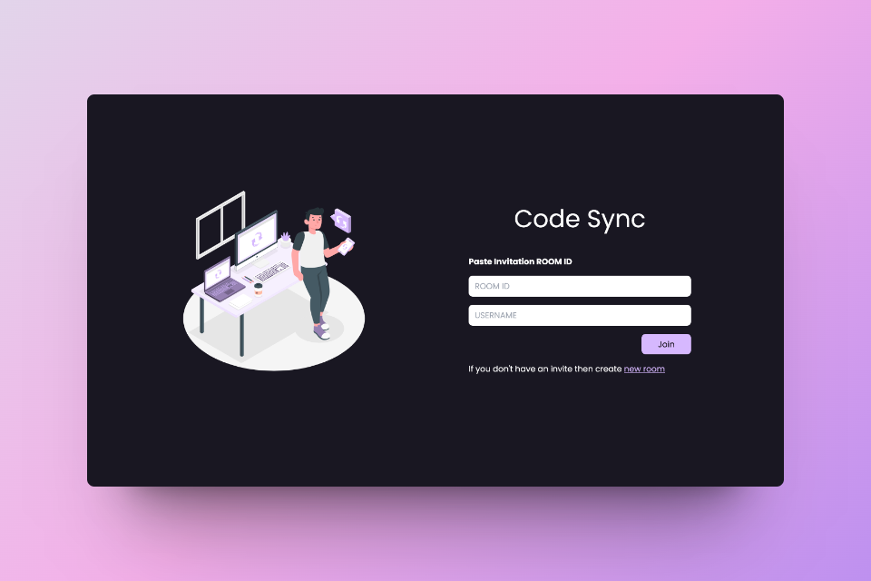

# Code Sync - A Realtime Code Editor




[]()
[]()
[]()
[]()
[]()
[]()
[]()
[]()

Code Sync is a collaborative, real-time code editor where users can seamlessly code together. It provides a platform for multiple users to enter a room, share a unique room ID, and collaborate on code simultaneously.

## 🔮 Features

-   💻 Real-time collaboration on code editing across multiple files
-   🚀 Unique room generation with room ID for collaboration
-   🌈 Syntax highlighting for various file types with auto-language detection
-   💡 Auto suggestion based on programming language
-   ⏱️ Instant updates and synchronization of code changes across all files
-   📣 Notifications for user join and leave events
-   🎨 Multiple themes for personalized coding experience
-   🌍 Comprehensive language support for versatile programming
-   🔠 Option to change font size and font family
-   👥 User presence list of users currently in the collaboration session, including online/offline status indicators
-   📁 Open, edit, save, and delete file functionalities
-   💾 Option to download files edited within the collaboration session
-   💬 **Group chatting** allows users to communicate in real-time while working on code.

## 💻 Tech Stack

### 🖥️ Frontend

-   **React JS:** A JavaScript library for building user interfaces, facilitating the creation of dynamic and efficient web applications.
-   **React Router:** Enables navigation and routing in React applications, managing the UI based on the URL.
-   **Tailwind CSS:** A utility-first CSS framework that streamlines the styling process with pre-defined classes.
-   **Vite:** A build tool for modern web development, providing faster development and better performance.
-   **PropTypes:** Runtime type checking for React props, helping to catch bugs early in development.
-   **UUID:** Generates unique identifiers, useful for key assignments in databases or component instances.
-   **Socket.io-client:** Implements real-time communication between the client and server using WebSockets.
-   **React-hot-toast:** A React library for creating customizable and responsive toast notifications.
-   **React-avatar:** Simplifies the display of avatars or profile pictures in React applications.
-   **@uiw/react-codemirror:** A versatile text editor implemented in React, providing an embeddable code editor for web applications.
-   **@uiw/codemirror-extensions:** Extensions for CodeMirror, enhancing the editor with additional features and capabilities.
-   **React Icons:** A collection of popular icons for React projects, providing easy integration of icons into the user interface.
-   **JSZIP**: A JavaScript library for creating, reading, and editing .zip files, useful for downloading multiple files as a single .zip file.

### 🌐 Backend

-   **Node.js:** A server-side JavaScript runtime, allowing the execution of JavaScript code outside the browser.
-   **Express:** A web application framework for Node.js, simplifying the creation of robust and scalable APIs.
-   **Socket.io:** Facilitates real-time bidirectional communication between clients and servers using WebSockets.
-   **Dotenv:** Loads environment variables from a .env file, enhancing the configuration of Node.js applications.
-   **CORS:** Stands for Cross-Origin Resource Sharing, a mechanism that permits or restricts web page access to resources on another domain.

## 📂 Folder Structure

```
client/
├── public/
│   └── style.css // Tailwind output
├── src/
│   ├── assets/
│   │   └── ...
│   ├── components/
│   │   ├── chat/
│   │   │   ├── ChatInput.jsx
│   │   │   └── ChatPanel.jsx
│   │   ├── common/
│   │   │   ├── Clients.jsx
│   │   │   ├── Footer.jsx
│   │   │   └── Select.jsx
│   │   ├── editor/
│   │   │   ├── Editor.jsx
│   │   │   └── EditorComponent.jsx
│   │   ├── files/
│   │   │   ├── FileEditor.jsx
│   │   │   └── FileSystem.jsx
│   │   ├── forms/
│   │   │   └── FormComponent.jsx
│   │   ├── loading/
│   │   │   └── Loading.jsx
│   │   ├── sidebar/
│   │   │   └── Sidebar.jsx
│   │   ├── tabs/
│   │   │   ├── FileTab.jsx
│   │   │   ├── SettingsTab.jsx
│   │   │   ├── UsersTab.jsx
│   │   │   └── TabButton.jsx
│   │   └── toast/
│   │       └── Toast.jsx
│   ├── context/
│   │   ├── AppContext.jsx
│   │   ├── AppProvider.jsx
│   │   ├── ChatContext.jsx
│   │   ├── FileContext.jsx
│   │   └── TabContext.jsx
│   ├── hooks/
│   │   ├── useChatRoom.jsx
│   │   ├── useFileSystem.jsx
│   │   ├── useLocalStorage.jsx
│   │   ├── usePageEvents.jsx
│   │   ├── useSocket.jsx
│   │   ├── useUserActivity.jsx
│   │   └── useWindowDimensions.jsx
│   ├── layouts/
│   │   └── EditorLayout.jsx
│   ├── pages/
│   │   ├── EditorPage.jsx
│   │   └── HomePage.jsx
│   ├── resources/
│   │   ├── Font.js
│   │   ├── Languages.js
│   │   └── Themes.js
│   ├── services/
│   │   └── socket.js
│   ├── utils/
│   │   ├── actions.js
│   │   ├── editorPlaceholder.js
│   │   ├── formateDate.js
│   │   ├── initialFile.js
│   │   └── tabs.js
│   ├── App.jsx
│   ├── index.css
│   └── main.jsx
├── .env
├── .eslintrc.cjs
├── .gitignore
├── index.html
├── package-lock.json
├── package.json
├── tailwind.config.js
└── vite.config.js

server/
├── utils/
│   └── actions.js
├── .gitignore
├── package-lock.json
├── package.json
└── server.js

screenshots/
CONTRIBUTING.md
LICENSE
README.md
```

## ⚙️ Installation

1. **Clone the repository:**
    ```bash
    git clone https://github.com/sahilatahar/Code-Sync.git
    ```
2. **Set .env file:**
   Inside the client and server directory, create or edit the .env file and add the following line:  
   Frontend:

    ```bash
    VITE_BACKEND_URL=<your_server_url>
    ```

    Backend:

    ```bash
    PORT=3000
    ```

3. **Install dependencies:**
   Navigate to the frontend and backend directories separately and run:
    ```bash
     npm install
    ```
4. **Start the frontend and backend servers:**  
   Frontend:
    ```bash
    cd client
    npm run dev
    ```
    Backend:
    ```bash
    cd server
    npm run dev
    ```
5. **Access the application:**
   Open a browser and enter the following URL:
    ```bash
    http://localhost:5173/
    ```

## 🔮 Features for next release

-   **Admin Permission:** Implement an admin permission system to manage user access levels and control over certain platform features.
-   **Search and Replace:** Implement a search and replace functionality for efficient code navigation.

## 🤝 Contribute

We welcome contributions to make Code Sync even better! Whether you're reporting a bug, suggesting a new feature, or fixing a typo, your input is valuable to us. Follow the [contribution guidelines](CONTRIBUTING.md) to get started.

## 🧾 License

This project is licensed under the [MIT License](LICENSE).

## ✍️ About Developer

-   Sahil Atahar (Aspiring Full Stack Developer)  
    [](https://github.com/sahilatahar)
    [](https://linkedin.com/in/sahilatahar)
