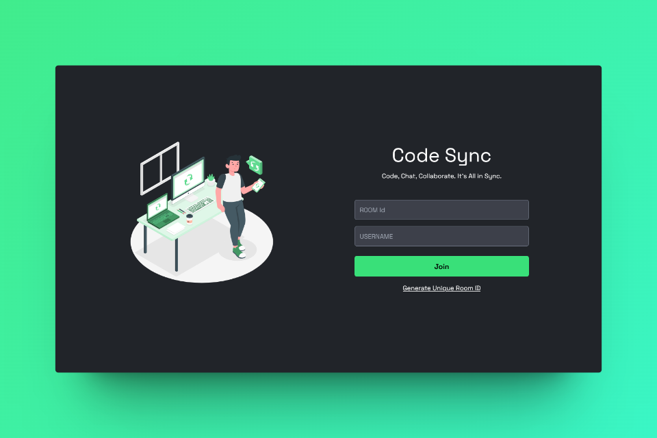

# Code Sync - A Realtime Code Editor



Code Sync is a collaborative, real-time code editor where users can seamlessly code together. It provides a platform for multiple users to enter a room, share a unique room ID, and collaborate on code simultaneously.


## 🔮 Features

-   💻 Real-time collaboration on code editing across multiple files
-   🚀 Unique room generation with room ID for collaboration
-   🌈 Syntax highlighting for various file types with auto-language detection
-   💡 Auto suggestion based on programming language
-   ⏱️ Instant updates and synchronization of code changes across all files
-   📣 Notifications for user join and leave events
-   🎨 Multiple themes for personalized coding experience
-   🌍 Comprehensive language support for versatile programming
-   🔠 Option to change font size and font family
-   👥 User presence list of users currently in the collaboration session, including online/offline status indicators
-   📁 Open, edit, save, and delete file functionalities
-   💾 Option to download files edited within the collaboration session
-   💬 **Group chatting** allows users to communicate in real-time while working on code.
-   🎩 Real-time tooltip displaying users currently editing

## 🚀 Live Preview

You can view the live preview of the project [here](https://code-sync-live.vercel.app/).

## 💻 Tech Stack


## 📂 Folder Structure

```
client/
├── public/
│   ├── favicon/
│   │   └── ...
├── src/
│   ├── assets/
│   │   └── ...
│   ├── components/
│   │   ├── chats/
│   │   │   ├── ChatInput.jsx
│   │   │   └── ChatList.jsx
│   │   ├── common/
│   │   │   ├── Users.jsx
│   │   │   ├── Footer.jsx
│   │   │   └── Select.jsx
│   │   ├── editor/
│   │   │   ├── tooltip.js
│   │   │   ├── Editor.jsx
│   │   │   └── EditorComponent.jsx
│   │   ├── files/
│   │   │   ├── FileEditor.jsx
│   │   │   └── FileSystem.jsx
│   │   ├── forms/
│   │   │   └── FormComponent.jsx
│   │   ├── loading/
│   │   │   └── Loading.jsx
│   │   ├── sidebar/
│   │   │   └── Sidebar.jsx
│   │   ├── tabs/
│   │   │   ├── ChatsTab.jsx
│   │   │   ├── UsersTab.jsx
│   │   │   ├── FileTab.jsx
│   │   │   ├── SettingsTab.jsx
│   │   │   └── TabButton.jsx
│   │   ├── toast/
│   │   │   └── Toast.jsx
│   │   ├── GitHubCorner.jsx
│   │   └── SplitterComponent.jsx
│   ├── context/
│   │   ├── AppContext.jsx
│   │   ├── AppProvider.jsx
│   │   ├── ChatContext.jsx
│   │   ├── FileContext.jsx
│   │   ├── SettingContext.jsx
│   │   ├── SocketContext.jsx
│   │   └── TabContext.jsx
│   ├── hooks/
│   │   ├── useAppContext.jsx
│   │   ├── useChatRoom.jsx
│   │   ├── useFileSystem.jsx
│   │   ├── useFullScreen.jsx
│   │   ├── useLocalStorage.jsx
│   │   ├── usePageEvents.jsx
│   │   ├── useResponsive.jsx
│   │   ├── useSetting.jsx
│   │   ├── useSocket.jsx
│   │   ├── useTab.jsx
│   │   ├── useUserActivity.jsx
│   │   └── useWindowDimensions.jsx
│   ├── pages/
│   │   ├── EditorPage.jsx
│   │   └── HomePage.jsx
│   ├── resources/
│   │   ├── Font.js
│   │   ├── Languages.js
│   │   └── Themes.js
│   ├── socket/
│   │   └── socket.js
│   ├── utils/
│   │   ├── actions.js
│   │   ├── editorPlaceholder.js
│   │   ├── formateDate.js
│   │   ├── initialFile.js
│   │   ├── getIconClassName.js
│   │   ├── status.js
│   │   └── tabs.js
│   ├── App.jsx
│   ├── index.css
│   └── main.jsx
├── .env
├── .eslintrc.cjs
├── .gitignore
├── index.html
├── package-lock.json
├── package.json
├── postcss.config.js
├── tailwind.config.js
└── vercel.json
└── vite.config.js

server/
├── utils/
│   └── actions.js
├── .env
├── .gitignore
├── package-lock.json
├── package.json
└── server.js

CONTRIBUTING.md
LICENSE
preview.png
README.md
```

## ⚙️ Installation

1. **Fork this repository:** Click the Fork button located in the top-right corner of this page to fork the repository.
2. **Clone the repository:**
    ```bash
    git clone https://github.com/<your-username>/Code-Sync.git
    ```
3. **Set .env file:**
   Inside the client and server directory, create or edit the .env file and add the following line:  
   Frontend:

    ```bash
    VITE_BACKEND_URL=<your_server_url>
    ```

    Backend:

    ```bash
    PORT=3000
    ```

4. **Install dependencies:**
   Navigate to the frontend and backend directories separately and run:
    ```bash
     npm install
    ```
5. **Start the frontend and backend servers:**  
   Frontend:
    ```bash
    cd client
    npm run dev
    ```
    Backend:
    ```bash
    cd server
    npm run dev
    ```
6. **Access the application:**
   Open a browser and enter the following URL:
    ```bash
    http://localhost:5173/
    ```

## 🔮 Features for next release

-   **Admin Permission:** Implement an admin permission system to manage user access levels and control over certain platform features.
-   **Search and Replace:** Implement a search and replace functionality for efficient code navigation.

## 🤝 Contribute

We welcome contributions to make Code Sync even better! Whether you're reporting a bug, suggesting a new feature, or fixing a typo, your input is valuable to us. Follow the [contribution guidelines](CONTRIBUTING.md) to get started.

## 🌟 Support Us

If you find this helpful or valuable, please consider 🌟 starring the repository. It helps us gain visibility and encourages further development. We appreciate your support!

## 🧾 License

This project is licensed under the [MIT License](LICENSE).

## ✍️ About Developer

<table>
  <tbody>
    <tr>
      <td align="center" valign="top">
        
        <br />
        <b>Sahil Atahar</b>
      </td>
    </tr>
    <tr>
        <td align="center">
            <a href="https://github.com/sahilatahar">
            
        </a>
        <br/>
        <a href="https://linkedin.com/in/sahilatahar">
            
        </a>
        </td>
    </tr>
  </tbody>
</table>
